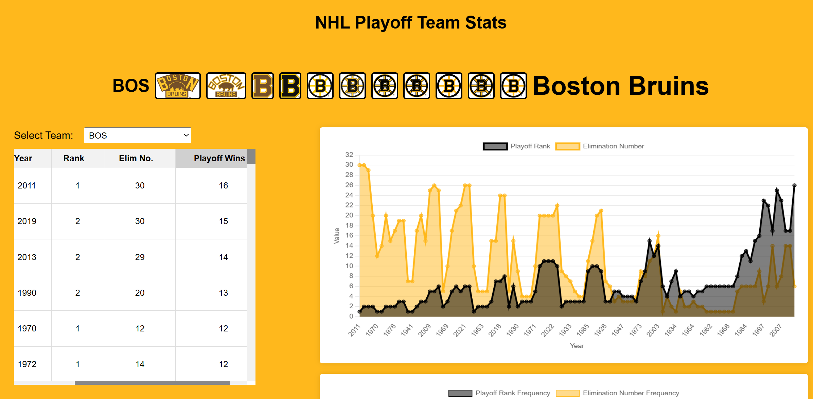

# NHL Playoff Team Stats

An interactive web app showcasing historical NHL playoff performance at the team level. 

## Features

- Simple, responsive front-end built with HTML, CSS, and JavaScript  
- Designed for future expansion and multi-sport support  
- Covers all 59 NHL franchises (32 current, 27 historical)  
- Team-specific pages with accurate color schemes and historical logos  
- Visualizes playoff performance through tables, bar charts, and line graphs  
- Includes team playoff rank, elimination number, and total playoff wins

## Screenshot

## Live Demo

The app is deployed via GitHub Pages: 

https://elevation-edge-sports-data.github.io/nhl-playoff-team-stats/

## Local Usage

To run the app locally:

1. Clone the repository:

git clone https://github.com/elevation-edge-sports-data/nhl-playoff-team-stats.git

2. Open `index.html` in your browser.  
No build step or backend is required; all content is static and client-side.

## Project Structure 

nhl-playoff-team-stats/
├── index.html # Main landing page with team directory
├── script.js # Powers interactivity on index and team pages
├── styles.css # Controls layout, colors, fonts, and responsiveness
├── logos/     # Historical team logos for each NHL season
│   ├── NHL1918/
│   ├── ...
│   └── NHL2026/
├── data.json/ # Team elimination and playoff data
├── NHLteamcolors.json/ # Team colors for each team
├── uniqelogos.json/ # Unique logos for each team
├── .nojekyll/ # No Jekyll File
├── screenshot.png/ # App screenshot
└── README.md # This documentation

## License

This project is open-source and freely available for personal or educational use.

Produced by Zach Sajevic (2025)